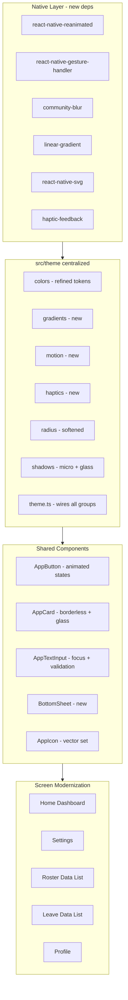
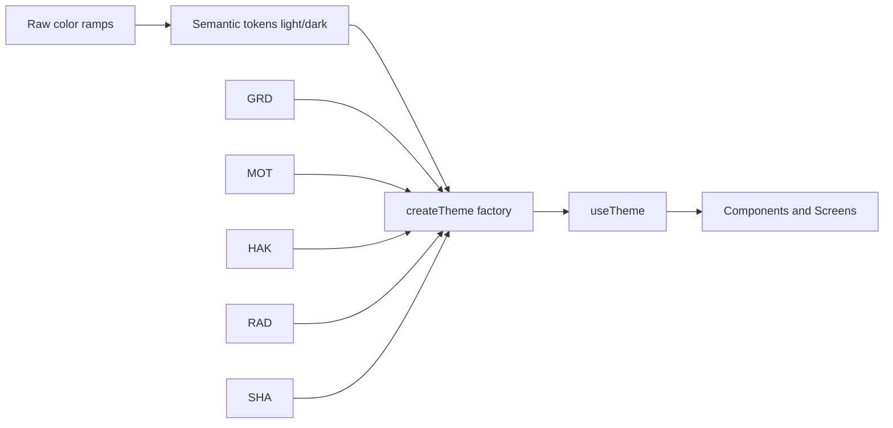

# StaffSaaSMobile — Comprehensive UI/UX Design Refactor Plan

## 1. Objective

Modernize the visual design, shared component library, and screen layouts of the existing
React Native app to match the design language of the reference app in
[`soft-ui-react-native-main/`](soft-ui-react-native-main/README.md:1) — **without altering any
business logic, API integration, state management, or functional flow.**

## 2. Decisions Locked

| Decision | Outcome |
| --- | --- |
| Palette direction | **Refine the existing Deep Ocean Blue brand** (lowest risk, preserves brand identity) |
| Native dependencies | **Approved** — enables true blur, gradients, vector icons, swipe-to-dismiss, haptics |
| Reference usage | Mine the **visual language** of Soft UI; do NOT port its props-based `Block`/`Input` API (would regress the existing layered architecture) |

## 3. Current-State Assessment

The app already implements a mature Phase 1–6 design system that satisfies much of the brief:

- **Centralized theme layer** — [`src/theme/colors.ts`](src/theme/colors.ts:1),
  [`spacing.ts`](src/theme/spacing.ts:1) (8pt grid), [`radius.ts`](src/theme/radius.ts:1),
  [`shadows.ts`](src/theme/shadows.ts:1), [`typography.ts`](src/theme/typography.ts:1),
  [`sizing.ts`](src/theme/sizing.ts:1), [`theme.ts`](src/theme/theme.ts:1),
  [`useTheme.ts`](src/theme/useTheme.ts:36)
- **Semantic light/dark tokens** with a total dark mirror contract (`lightColors` / `darkColors`)
- **Floating-label inputs** — [`AppTextInput.tsx`](src/components/AppTextInput/AppTextInput.tsx:197)
- **Elevated cards** — [`AppCard.tsx`](src/components/AppCard/AppCard.tsx:52)
- **Animated skeleton loaders** — [`Skeleton.tsx`](src/components/Skeleton/Skeleton.tsx:99)
- **Custom tab bar** — [`AppTabs.tsx`](src/navigation/stacks/AppTabs.tsx:87)

### Genuine Gaps (the real work)

1. **No blur / glassmorphism** — overlays are opaque.
2. **No real vector icon set** — [`AppTabs.tsx`](src/navigation/stacks/AppTabs.tsx:33) renders
   letter plates `H/R/A/L/M`; [`glyphs.tsx`](src/components/AppIcon/glyphs.tsx:28) hand-draws
   icons from absolutely-positioned Views (documented placeholders).
3. **No gradients.**
4. **Stark native alerts** — [`AccountScreen.tsx`](src/features/settings/screens/AccountScreen.tsx:98)
   uses `Alert.alert` for destructive confirmations instead of bottom sheets.
5. **Instant (non-animated) press states** —
   [`AppButton.tsx`](src/components/AppButton/AppButton.tsx:117) uses static `pressed` styles.
6. **No haptics.**

## 4. Target Architecture

### Token Flow

## 5. Execution Phases

### Phase A — Native Foundation
Install and configure native deps: `react-native-reanimated`, `react-native-gesture-handler`,
`@react-native-community/blur`, `react-native-linear-gradient`, `react-native-svg`,
`react-native-haptic-feedback`. Add the Reanimated babel plugin, wrap root in
`GestureHandlerRootView`, run pod install, verify both platforms still compile.
**Business logic untouched — build config only.**

### Phase B — Centralized Theme Extensions
Extend [`colors.ts`](src/theme/colors.ts:151) with semantic tokens: glass surface, overlay/scrim,
hairline border, focus ring, gradient stop ramps. Add new modules `gradients.ts`, `motion.ts`,
`haptics.ts`. Refine [`radius.ts`](src/theme/radius.ts:1) toward 12–20px and
[`shadows.ts`](src/theme/shadows.ts:1) with micro-shadow + glass specs. Wire everything through
[`theme.ts`](src/theme/theme.ts:67) and [`index.ts`](src/theme/index.ts:1) so `useTheme()` exposes
gradients, motion, and haptics. **This is the single source of truth for all styling.**

### Phase C — Shared Component Upgrades
- [`AppButton.tsx`](src/components/AppButton/AppButton.tsx:55) — Reanimated press scale, haptic
  feedback, polished default/pressed/loading/disabled states.
- [`AppCard.tsx`](src/components/AppCard/AppCard.tsx:52) — borderless container card, unified
  padding, subtle shadow or light gray fill, optional glass variant.
- [`AppTextInput.tsx`](src/components/AppTextInput/AppTextInput.tsx:197) — accent focus border +
  inline validation styling; preserve floating-label behavior.
- **New `BottomSheet`** — fluid swipe-to-dismiss via gesture-handler + Reanimated, blurred
  glassmorphism overlay via community-blur.
- [`AppIcon.tsx`](src/components/AppIcon/AppIcon.tsx:66) — migrate
  [`glyphs.tsx`](src/components/AppIcon/glyphs.tsx:28) to a real vector set behind the existing
  `IconComponent` contract so no atom API changes.
- [`AppListItem.tsx`](src/components/AppListItem/AppListItem.tsx:59),
  [`AppHeader.tsx`](src/components/AppHeader/AppHeader.tsx:88),
  [`TabBarItem.tsx`](src/components/TabBarItem/TabBarItem.tsx:61) — refine to the new language.

### Phase D — Navigation & Overlay Integration
Update [`AppTabs.tsx`](src/navigation/stacks/AppTabs.tsx:87) to real minimalist icons and a smooth
animated active indicator. Replace `Alert.alert` destructive confirmations (starting with
[`AccountScreen.tsx`](src/features/settings/screens/AccountScreen.tsx:98)) with the new BottomSheet.
Replace the raw `<Modal>` in [`datePicker.tsx`](src/features/leave/utils/datePicker.tsx:1) with the
blurred sheet presentation.

### Phase E — Screen Modernization
Modernize Home dashboard ([`HomeScreen.tsx`](src/features/home/screens/HomeScreen.tsx:43)) with
asymmetry, hierarchy, prominent typography; settings
([`AccountScreen.tsx`](src/features/settings/screens/AccountScreen.tsx:50)); Roster and Leave data
lists; Profile. Apply expanded 8pt spacing rhythm everywhere; guarantee skeleton coverage for all
content-fetching states.

### Phase F — Verification
Update affected tests, run the full suite + typecheck + lint, verify light/dark parity and
reduce-motion accessibility, and update the `.roo` specs to reflect new tokens/contracts.

## 6. Non-Negotiable Guardrails

- **No changes** to API clients, hooks' data flow, stores, navigation graph structure, or
  form/validation logic. Only presentational layers are touched.
- Every new visual constant lives in `src/theme` — no ad-hoc magic values in components.
- All new animations respect `useReduceMotion()`
  ([`Skeleton.tsx`](src/components/Skeleton/Skeleton.tsx:65)).
- The `IconComponent` contract ([`AppIcon.tsx`](src/components/AppIcon/AppIcon.tsx:21)) stays
  stable so consumers never change.
- Existing testIDs are preserved so the test suite remains meaningful.

## 7. Open Risks

| Risk | Mitigation |
| --- | --- |
| Native rebuild breaks bare RN 0.87 build | Verify compile immediately after Phase A, before any UI work |
| Reanimated babel plugin conflicts with existing Metro config | Validate in Phase A step 2 |
| Blur performance on low-end Android | Provide a non-blur fallback surface token |
| Icon migration changes glyph geometry | Preserve size/color/strokeWidth contract; visual diff each icon |
